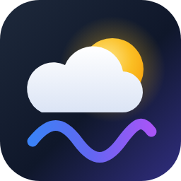

# AxolDad

**CEO & Founder, Code Pause Inc.** · Rust and TypeScript systems engineer · 25-year EMT and crisis responder

Building privacy-first infrastructure for clinical care teams, live media, and confidential analytics.

<a href="https://codepause.com"><picture><source media="(prefers-color-scheme: dark)" srcset="assets/codepause-dark.svg"></picture></a>&nbsp;&nbsp;&nbsp;
&nbsp;&nbsp;&nbsp;
&nbsp;&nbsp;&nbsp;
&nbsp;&nbsp;&nbsp;

---

## News

**September 8, 2026 — [Code Pause, Inc. Advances Real-Time Communications with Voxi.live and Telehealth over QUIC](https://codepause.com/press/voxi-live-telehealth-over-quic/)**

A live, browser-based Voxi.Live avatar session measured approximately 93 ms of edge-clock-calibrated capture-to-render video latency over Media over QUIC (≈30 fps VP8 over MOQT draft 16 at ≈1.42 Mbps, zero decoder rejections, zero decoder backlog). The same communications foundation is being applied to Telehealth over QUIC (ToQ) for OutsideINsights. Also published on [voxi.live](https://voxi.live/press/voxi-live-telehealth-over-quic) and [outsideinsights.health](https://outsideinsights.health/press/voxi-live-telehealth-over-quic).

---

## About

I build systems where the operator never has to be trusted with the data. Twenty-five years as an EMT and crisis responder taught me what happens when systems fail the people inside them, and that is the standard I design against.

- **Founder and CEO of [Code Pause Inc.](https://codepause.com)**, building **[OutsideINsights](https://outsideinsights.health)** for clinical care teams and **[Voxi.Live](https://voxi.live)** for live broadcast on the open web.
- **Engineer across the stack, by necessity.** Rust where the trust boundaries live, TypeScript where the people do, Media over QUIC where the latency does, and HIPAA-grade architecture underneath all of it.
- **Building open communication standards for delay-tolerant space systems** with the **[Pale Blue Systems Foundation](https://github.com/Pale-Blue-Systems)**.
- **EMT and crisis responder for 25 years**, currently volunteering on 988 crisis lines, with a background in psychology and behavioral health.
- **Decades as a logistician** before I wrote software: the United States Air Force (Logistics Management Specialist, Security Forces, and Chemical Warfare Survival Instructor), local and regional disaster response, the American Red Cross, and multiple private organizations. It is why I built [xin.bz](https://xin.bz).
- Off the clock: father of five, rare books, commemorative coins, aquascaping, welding, and a modern adaptation of *The Mysteries of Udolpho*.

---

## Positions

**Vibe coding does not belong in shipped systems.** Agentic engineering with strict roadmaps, guidelines, validation, and a human in the loop is what turns a project that would get built two years from now into one being tested in two weeks.

**Leaks of sensitive health data make me livid.** We know what to do and how to do it to protect this data. We cannot stop every leak when the weakest link is a human with a password, but we can sure as hell make it hard and keep it contained.

**If the operator can read the data, assume one day someone else will.** Design so that the operator never has to be trusted: encrypt at ingest, compute inside an attested boundary, and let only answers out.

---

## Open Work

- **[Pale Blue Systems Foundation](https://github.com/Pale-Blue-Systems)**: open, interoperable communication standards for delay-tolerant space systems, published under my name, Jeremy L. D. Ryan.
  - [PBS-PROTOCOL-OPEN](https://github.com/Pale-Blue-Systems/PBS-PROTOCOL-OPEN): the core specification for envelopes, addressing, priority, security, and routing across disrupted networks (Apache 2.0)
  - [PBS_LINK](https://github.com/Pale-Blue-Systems/PBS_LINK): Python reference SDK for packaging telemetry and alerts on lunar and deep-space devices (Apache 2.0)
  - [PBS-EDGE-ADAPTER-MV](https://github.com/Pale-Blue-Systems/PBS-EDGE-ADAPTER-MV): deterministic mapping of PBS envelopes into Bundle Protocol v7 (RFC 9171)
  - [PBS Application-Layer Risk Management](https://github.com/Pale-Blue-Systems/PBS-APPLICATION-LAYER-RISK-MANAGMENT): data and power budget governors for metered and battery-constrained links (Apache 2.0)
- **[Chess engine](https://ioio.dev)**: written in Rust, compiled to WebAssembly, and playable in the browser with all computation client-side.
- More projects at **[ioio.dev](https://ioio.dev)**. More open source on the way.

---

## Current Work

###  [OutsideINsights](https://outsideinsights.health) · Clinical Intelligence
*What happens outside the visit belongs inside the record.*

- Clinical intelligence for care teams: connected-device data and home context, delivered into the chart
- EHR-native with Epic, Oracle Health, and athenahealth
- FDA-cleared monitoring devices
- Clinical evidence published in the Journal of General Internal Medicine
- Built for Medicare Advantage plans and payers

### Encrypted-First Analytical Infrastructure · Rust
*Data goes in. Analysis comes out. The dataset doesn't.*

- Analytics over data the operator cannot read: encrypted at ingest, at rest, and in flight
- Confidential computing with hardware-attested enclaves
- Aggregate-only query engine that structurally blocks record-level access
- Metered, governed research access for data owners and third-party researchers

###  [Voxi.Live](https://voxi.live) · Live Broadcast
*Go live as you. Or anyone. Anywhere.*

- Built on Media over QUIC (MoQ), tracking the IETF transport spec at draft-16, on the Cloudflare MoQ relay system
- Measured ≈93 ms capture-to-render latency in a live avatar session ([press release](https://codepause.com/press/voxi-live-telehealth-over-quic/))
- WHIP in, MoQ out, LL-HLS fallback from the same segments; chat, presence, and reactions ride the same QUIC connection as video
- Rust end to end, including the WebAssembly browser player
- Browser-native studio: the tab encodes and publishes directly, and the server never sees an unencoded pixel
- Avatar platform for the open web, in alpha

###  [AdminAbuse.app](https://adminabuse.app) · Live Events
*Live and scheduled admin abuse across the biggest Roblox games.*

- Live and scheduled admin sessions across the most played Roblox games, refreshed every minute from Roblox's public events API
- No signup: developers describe the session in their event listing, streamers tag their title, and both are picked up within minutes
- Every listing shows how confident the match is and the exact words it came from

###  [WeatherVibe.app](https://weathervibe.app) · Weather Intelligence
*Live US weather translated into plain-language lifestyle insights.*

- Run Report, Skin Health, Frizz Forecast, Migraine Meter, Pollen Count, and air-quality risk, each backed by published atmospheric science
- Built on National Weather Service forecasts and observations, enriched with EPA AirNow, Google Pollen, and OpenWeather data
- Sky cards for aurora probability, light pollution, moon phase, meteor showers, and eclipses, drawn from NOAA and NASA open data and computed locally
- Web app on Cloudflare Workers

### [Pale Blue Systems Foundation](https://github.com/Pale-Blue-Systems) · Space Communications
*Interoperability before the infrastructure is fixed.* Published as Jeremy L. D. Ryan.

- Open standards for delay-tolerant communication across spacecraft, rovers, habitats, and ground systems
- Store-and-forward by design, aligned with DTN, BPv7, and CCSDS
- Advanced multiplexing and optical transmission research for high-bandwidth links

### Crisis Intervention

- Peer-to-peer de-escalation training and tools, grounded in 25 years of field experience

### Applied AI

- Fast/slow model architectures for clinical intelligence

---

## Technical Expertise

**Systems**

**Web**

**Domains:** confidential computing · applied cryptography · HIPAA-compliant systems · EHR integration · Media over QUIC and low-latency media transport · delay-tolerant networking · optical communications

---

## Currently

- Building the encrypted analytics platform in Rust
- Shipping the Voxi.Live alpha
- Raising a funding round for OutsideINsights
- Developing market intelligence on Medicare Advantage payers

---

## Contact

Open to conversations with investors, collaborators, and teams working in confidential computing, healthcare, live media, or space communications.

- OutsideINsights: [outsideinsights.health](https://outsideinsights.health)
- Voxi.Live: [voxi.live](https://voxi.live)
- AdminAbuse.app: [adminabuse.app](https://adminabuse.app)
- WeatherVibe.app: [weathervibe.app](https://weathervibe.app)
- Pale Blue Systems Foundation: [github.com/Pale-Blue-Systems](https://github.com/Pale-Blue-Systems)
- Company: [codepause.com](https://codepause.com)
- Portfolio: [ioio.dev](https://ioio.dev)

*Build with purpose. Stay curious.*

<!---
AxolDad/AxolDad is a special repository because its README.md (this file) appears on your GitHub profile.
--->
